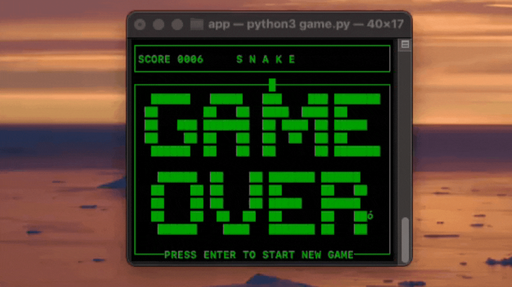

## SNAKE GAME IN TERMINAL

***
Snake game written in Python using curses. It is modeled after the classic Snake game from old Nokia phones. This project serves as an example of using the curses library to create Text User Interfaces (TUI).
# Description
***
In the game, you control a snake moving across the board. Your objective is to collect apples, which causes the snake to grow and increases your score. You must be careful to avoid hitting the walls or your own tail.
***
# Features
- Controls: Navigate using the arrow keys (↑, ↓, ←, →)
- Gameplay: Food appears in random locations. For every fruit collected, you earn point and the snake elongates.
- Game Over: The game ends if you collide with a wall or the snake's body
***
# Requirements 

- Python 3.8+ 
- System operacyjny: Linux, macOS
***

# Gameplay



***
# Installation

1. Clone the repository and move:
    ```bash
    cd snake_python\app
   ```

2. Create a virtual environment: 
    ```bash
    python -m venv venv
   ```

3. Open a terminal in the folder (snake_python/app) with dimensions exactly 40x17 (rows x cols).

4. Run the program:
    ```bash
    python3 game.py
   ```
***
## Autor
👨‍💻 Piotr Frasik
